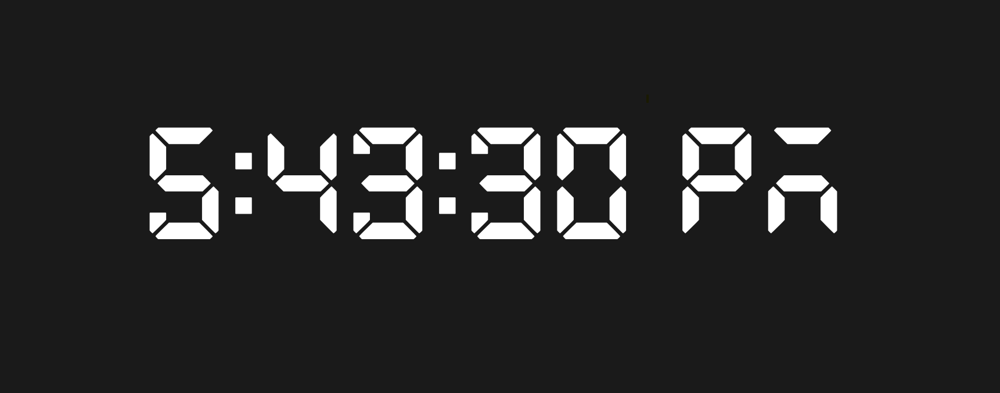

# Digital-Clock
A simple and elegant digital clock application that displays the current time in real-time.


## Description

This project is a lightweight digital clock built to demonstrate basic time manipulation and DOM updates. It features a clean interface that updates every second to reflect the current local time of the user's system.

## Features

- **Real-Time Display**: Shows hours, minutes, and seconds.
- **Dynamic Updates**: The time refreshes automatically without page reloads.
- **Responsive Design**: Adjusts to fit different screen sizes.

## Technologies Used

- HTML
- CSS
- JavaScript

## Getting Started

To run this project locally on your machine:

1. **Clone the repository**
   ```bash
   git clone https://github.com/your-username/Digital-Clock.git
   ```

2. **Open the project**
   - Navigate to the project folder.
   - Open the `index.html` file in any modern web browser (Chrome, Firefox, Edge, etc.).

## Usage

Once opened, the clock will immediately display the current time based on your system settings.

## License

This project is open source and available under the MIT License.